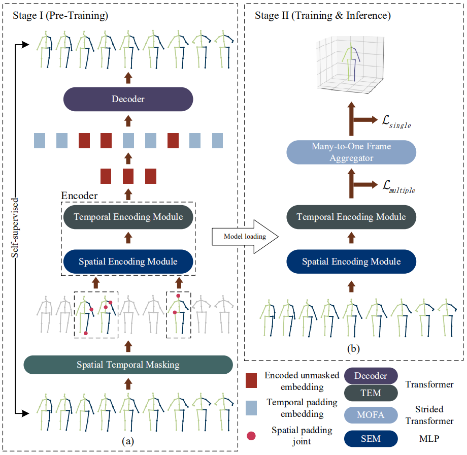

# P-STMO: Pre-Trained Spatial Temporal Many-to-One Model for 3D Human Pose Estimation [ECCV2022]
<p align="center"></p>
The PyTorch implementation for <a href="https://arxiv.org/pdf/2203.07628.pdf">"P-STMO: Pre-Trained Spatial Temporal Many-to-One Model for 3D Human Pose Estimation"</a> .

## Qualitative and quantitative results
<p align="center"></p>
<p align="center"></p>

| Method | MPJPE(mm) | FPS |
|  :----:  | :----: | :----: |
| [PoseFormer](https://github.com/zczcwh/PoseFormer) | 44.3 | 1952 |
| [Anatomy3D](https://github.com/sunnychencool/Anatomy3D) | 44.1 | 429 |
| P-STMO-S | 43.0 | **3504** |
| P-STMO | **42.8** | 3040 |

## Dependencies

Make sure you have the following dependencies installed:

* PyTorch >= 0.4.0
* NumPy
* Matplotlib=3.1.0
* FFmpeg (if you want to export MP4 videos)
* ImageMagick (if you want to export GIFs)
* Matlab

## Dataset

Our model is evaluated on [Human3.6M](http://vision.imar.ro/human3.6m) and [MPI-INF-3DHP](https://vcai.mpi-inf.mpg.de/3dhp-dataset/) datasets. 

### Human3.6M
We set up the Human3.6M dataset in the same way as [VideoPose3D](https://github.com/facebookresearch/VideoPose3D/blob/master/DATASETS.md).  You can download the processed data from [here](https://drive.google.com/file/d/1FMgAf_I04GlweHMfgUKzB0CMwglxuwPe/view?usp=sharing).  `data_2d_h36m_gt.npz` is the ground truth of 2D keypoints. `data_2d_h36m_cpn_ft_h36m_dbb.npz` is the 2D keypoints obatined by [CPN](https://github.com/GengDavid/pytorch-cpn).  `data_3d_h36m.npz` is the ground truth of 3D human joints. Put them in the `./dataset` directory.

### MPI-INF-3DHP
We set up the MPI-INF-3DHP dataset by ourselves. We convert the original data in `.mat` format to the processed data in `.npz` format by using `data_to_npz_3dhp.py` and `data_to_npz_3dhp_test.py`. You can download the processed data from [here](https://drive.google.com/file/d/11eBe175Rgj6IYrwZwa1oXTOyHPxGuWyi/view?usp=sharing). Put them in the `./dataset` directory. In addition, if you want to get the PCK and AUC metrics on this dataset, you also need to download the original dataset from the [official website](https://vcai.mpi-inf.mpg.de/3dhp-dataset/). After downloading the dataset, you can place the `TS1` to `TS6` folders in the test set under the `./3dhp_test` folder in this repo. 

## Evaluating our models
You can download our pre-trained models from [here](https://drive.google.com/file/d/1vLtC86_hs01JKKRQ6akvdH5QDKxt71cY/view?usp=sharing). Put them in the `./checkpoint` directory. 
### Human 3.6M

To evaluate our P-STMO-S model on the ground truth of 2D keypoints, please run:
```bash
python run.py -k gt -f 243 -tds 2 --reload 1 --previous_dir checkpoint/PSTMOS_no_refine_15_2936_h36m_gt.pth
```

The following models are trained using the 2D keypoints obtained by CPN as inputs.

To evaluate our P-STMO-S model, please run:
```bash
python run.py -f 243 -tds 2 --reload 1 --previous_dir checkpoint/PSTMOS_no_refine_28_4306_h36m_cpn.pth
```

To evaluate our P-STMO model, please run:
```bash
python run.py -f 243 -tds 2 --reload 1 --layers 4 --previous_dir checkpoint/PSTMO_no_refine_11_4288_h36m_cpn.pth
```

To evaluate our P-STMO model using the refine module proposed in [ST-GCN](https://openaccess.thecvf.com/content_ICCV_2019/papers/Cai_Exploiting_Spatial-Temporal_Relationships_for_3D_Pose_Estimation_via_Graph_Convolutional_ICCV_2019_paper.pdf), please run:
```bash
python run.py -f 243 -tds 2 --reload 1 --refine_reload 1 --refine --layers 4 --previous_dir checkpoint/PSTMO_no_refine_6_4215_h36m_cpn.pth --previous_refine_name checkpoint/PSTMO_refine_6_4215_h36m_cpn.pth
```

### MPI-INF-3DHP
To evaluate our P-STMO-S model on MPI-INF-3DHP dataset, please run:
```bash
python run_3dhp.py -f 81 --reload 1 --previous_dir checkpoint/PSTMOS_no_refine_50_3203_3dhp.pth
```
After that, the 3D pose predictions are saved as `./checkpoint/inference_data.mat`. These results can be evaluated using Matlab by running `./3dhp_test/test_util/mpii_test_predictions_py.m`. The final evaluation results can be found in `./3dhp_test/mpii_3dhp_evaluation_sequencewise.csv`, which is obtained by averaging sequencewise evaluation results over the number of frames. For visualization, you can use `./common/draw_3d_keypoint_3dhp.py` and `./common/draw_2d_keypoint_3dhp.py`.

## Training from scratch
### Human 3.6M
For the pre-training stage, our model aims to solve the *masked pose modeling* task. Please run:
```bash
python run.py -f 243 -b 160 --MAE --train 1 --layers 3 -tds 2 -tmr 0.8 -smn 2 --lr 0.0001 -lrd 0.97
```
Different models use different configurations as follows.
| Model | -k | --layers | -tmr | -smn |
|  :----:  | :----: | :----: | :----: | :----: |
| P-STMO-S (GT)| gt | 3 | 0.8 | 7 | 
| P-STMO-S | default | 3 | 0.8 | 2 |
| P-STMO | default | 4 | 0.6 | 3 |

For the fine-tuning stage, the pre-trained encoder is loaded to our STMO model and fine-tuned. Please run:
```bash
python run.py -f 243 -b 160 --train 1 --layers 3 -tds 2 --lr 0.0007 -lrd 0.97 --MAE_reload 1 --previous_dir your_best_model_in_stage_I.pth
```
Different models use different configurations as follows.
| Model | -k | --layers | --lr |
|  :----:  | :----: | :----: | :----: | 
| P-STMO-S (GT)| gt | 3 | 0.001 | 
| P-STMO-S | default | 3 | 0.0007 |
| P-STMO | default | 4 | 0.001 |

### MPI-INF-3DHP
We only train and evaluate our P-STMO-S model on MPI-INF-3DHP dataset using the ground truth of 2D keypoints as inputs.

For the pre-training stage, please run:
```bash
python run_3dhp.py -f 81 -b 160 --MAE --train 1 --layers 3 -tmr 0.7 -smn 2 --lr 0.0001 -lrd 0.97
```

For the fine-tuning stage, please run:
```bash
python run_3dhp.py -f 81 -b 160 --train 1 --layers 3 --lr 0.0007 -lrd 0.97 --MAE_reload 1 --previous_dir your_best_model_in_stage_I.pth
```

## Testing on in-the-wild videos
To test our model on custom videos, you can use an off-the-shelf 2D keypoint detector (such as [AlphaPose](https://github.com/MVIG-SJTU/AlphaPose)) to yield 2D poses from images and use our model to yield 3D poses. The 2D keypoint detectors are trained on [COCO](https://cocodataset.org/#home) dataset, which defines the order of human joints in a different way from Human3.6M. Thus, our model needs to be re-trained to be compatible with the existing detectors. Our model takes 2D keypoints in COCO format, which can be downloaded from [here](https://drive.google.com/file/d/1xO0Oo1yV3-5eQSIBUyIzelvaAwWpLqM5/view?usp=sharing), as inputs and outputs 3D joint positions in Human3.6M format.

You can use our pre-trained model `PSTMOS_no_refine_48_5137_in_the_wild.pth` or train our model from scratch using the following commands.

For the pre-training stage, please run:
```bash
python run_in_the_wild.py -k detectron_pt_coco -f 243 -b 160 --MAE --train 1 --layers 3 -tds 2 -tmr 0.8 -smn 2 --lr 0.0001 -lrd 0.97
```

For the fine-tuning stage, please run:
```bash
python run_in_the_wild.py -k detectron_pt_coco -f 243 -b 160 --train 1 --layers 3 -tds 2 --lr 0.0007 -lrd 0.97 --MAE_reload 1 --previous_dir your_best_model_in_stage_I.pth
```

After that, you can evaluate our models on in-the-wild videos using this [repo](https://github.com/zh-plus/video-to-pose3D). Please follow the below instructions.
1. Follow their `README.md` to set up the code.
2. Put the checkpoint in the `checkpoint/` folder of their repo.
3. Put the `model/` folder and `in_the_wild/videopose_PSTMO.py` in the root path of their repo.
4. Put `in_the_wild/arguments.py`, `in_the_wild/generators.py`, and `in_the_wild/inference_3d.py` in the `common/` folder of their repo.
5. Run `videopose_PSTMO.py`!

Note that the frame rate of Human3.6M dataset is 50 fps, while most of the videos are at 25 or 30 fps. So we set `tds=2` during training and `tds=1` during testing.


## Citation
If you find this repo useful, please consider citing our paper:
```
@inproceedings{shan2022p,
  title={P-stmo: Pre-trained spatial temporal many-to-one model for 3d human pose estimation},
  author={Shan, Wenkang and Liu, Zhenhua and Zhang, Xinfeng and Wang, Shanshe and Ma, Siwei and Gao, Wen},
  booktitle={Computer Vision--ECCV 2022: 17th European Conference, Tel Aviv, Israel, October 23--27, 2022, Proceedings, Part V},
  pages={461--478},
  year={2022},
  organization={Springer}
}
```

## Acknowledgement
Our code refers to the following repositories.
* [VideoPose3D](https://github.com/facebookresearch/VideoPose3D)
* [StridedTransformer-Pose3D](https://github.com/Vegetebird/StridedTransformer-Pose3D)
* [ST-GCN](https://github.com/vanoracai/Exploiting-Spatial-temporal-Relationships-for-3D-Pose-Estimation-via-Graph-Convolutional-Networks)
* [MAE-pytorch](https://github.com/pengzhiliang/MAE-pytorch)
* [video-to-pose3D](https://github.com/zh-plus/video-to-pose3D)

We thank the authors for releasing their codes.